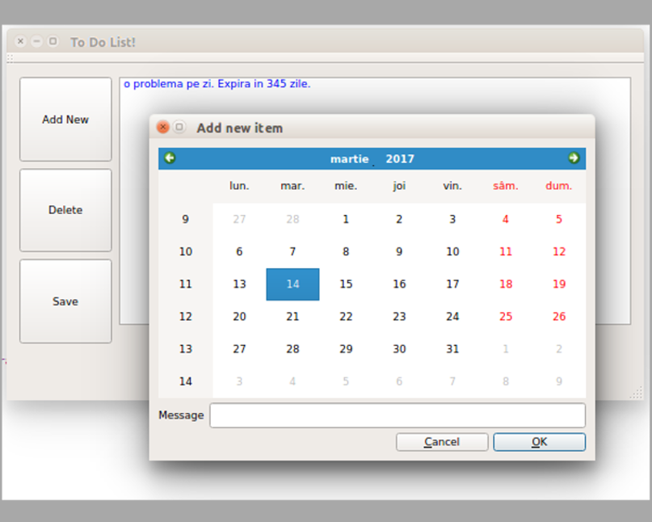

# To-do-list
To-do-list application using <a href = "https://doc.qt.io/qt-5/">Qt 5.7</a>

This is an application build to exercise Qt.

As shown in the image, the application has 3 basic functionalities:

1) You can add a new item to the list.
  When the Add New button is clicked, a new window is opened containing a calendar widget from which you can select an end date for the item. You can also specify a description for the item in this window.
2) You can delete an item from the list. 
  This action is very simple because every item is stored internally as a linked list so deletion of an item becomes deletion of a node of the list.
3) You can save the new changes.
  The save is about a file stored in the same folder as the executable. In this file is stored every item and every time the application starts, it builds the linked list based on this file. When the Save button is pressed, this file is replaced with the new list from the application memory.

